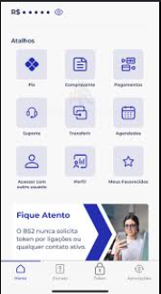

# Tokeniza.web3 - Plataforma de Tokenização de Ativos Reais

[](https://github.com/yourusername/tokeniza.web3)
[](LICENSE)

<p align="center">
  
</p>

## 📝 Visão Geral

O **Tokeniza.web3** é uma plataforma educativa e funcional para a tokenização de ativos do mundo real utilizando tecnologias blockchain. A plataforma permite a criação, gestão e negociação de tokens representativos de ativos reais (imóveis, obras de arte, commodities, etc.) de forma transparente, segura e em conformidade com regulamentações relevantes.

### 💡 Recursos Principais

- **Tokenização 🪙**: Processo guiado para transformar ativos físicos em tokens digitais
- **Marketplace 🛒**: Ambiente para negociação de ativos tokenizados
- **Simulação 🎮**: Ferramenta educacional para entender o processo de tokenização
- **Integração Web3 🔗**: Suporte para múltiplas carteiras blockchain (Ethereum, Solana)
- **Documentação Educativa 📚**: Conteúdo explicativo sobre tokenização e blockchain

## 🧰 Stack Tecnológico

### Frontend
- **Framework**: Next.js 13+ com React 18
- **Linguagem**: TypeScript
- **Estilização**: TailwindCSS
- **Estado**: Zustand
- **Web3**: ethers.js, wagmi

### Backend
- **Framework**: Axum (Rust)
- **Banco de Dados**: PostgreSQL (via Prisma)
- **API**: RESTful

### Blockchain
- **Contracts**: Solidity 0.8+
- **Ferramentas**: Foundry, Hardhat
- **Bibliotecas**: OpenZeppelin

## 🚀 Como Iniciar

### Pré-requisitos

- Node.js 18+
- Rust 1.70+
- PostgreSQL
- Foundry (forge, anvil)
- Metamask ou outra carteira compatível

### Instalação

1. **Clone o repositório**

```powershell
git clone https://github.com/yourusername/tokeniza.web3.git
cd tokeniza.web3
```

2. **Configuração do Frontend**

```powershell
cd tokenizacao-app/app
npm install
cp .env.example .env.local
# Configure as variáveis de ambiente necessárias
```

3. **Configuração do Backend**

```powershell
cd ../backend
cp .env.example .env
# Configure as variáveis de ambiente necessárias
cargo build
```

4. **Configuração da Blockchain**

```powershell
cd ../onchain
forge install
cp .env.example .env
# Configure as variáveis de ambiente necessárias
```

### Executando o Projeto

1. **Iniciar o Ambiente de Blockchain Local**

```powershell
cd tokenizacao-app/onchain
./script/start_anvil.sh
```

2. **Deployar os Contratos**

```powershell
cd tokenizacao-app/onchain
./script/deploy_local.sh
```

3. **Iniciar o Backend**

```powershell
cd tokenizacao-app/backend
cargo run
```

4. **Iniciar o Frontend**

```powershell
cd tokenizacao-app/app
npm run dev
```

5. **Acesse a aplicação**

Abra seu navegador e acesse `http://localhost:3000`

## 📚 Documentação

- [Guia de Testes de Contratos](./guia-teste-contratos.md)
- [Guia de Produção](./docs/Guia_Producao_Tokenizacao.md)
- [Documentação de Pesquisa](./tokenizacao_pesquisa.md)
- [Detecção de Ambiente](./tokenizacao-app/deteccao-ambiente.md)
- [Integração Foundry](./tokenizacao-app/foundry-integration.md)

## 🧪 Testes

### Frontend
```powershell
cd tokenizacao-app/app
npm test
```

### Backend
```powershell
cd tokenizacao-app/backend
cargo test
```

### Smart Contracts
```powershell
cd tokenizacao-app/onchain
forge test
```

## 🔐 Segurança

Este projeto implementa as melhores práticas de segurança para contratos inteligentes:

- Utilização de padrões OpenZeppelin
- Padrões anti-reentrância
- Controle de acesso baseado em papéis
- Testes automatizados abrangentes
- Verificação de overflow/underflow

## 📊 Arquitetura

```
tokenizacao-app/
├── app/             # Frontend Next.js
├── backend/         # Backend Rust/Axum
└── onchain/         # Smart Contracts Solidity/Foundry
```

## 🎯 Roadmap

- [x] MVP com tokenização básica
- [x] Marketplace de tokens
- [ ] Integração com oráculos para avaliação de ativos
- [ ] Sistema de governança descentralizada
- [ ] Suporte para fracionamento de tokens
- [ ] Integração com DeFi para liquidez

## 👥 Contribuição

Contribuições são bem-vindas! Por favor, leia as [diretrizes de contribuição](CONTRIBUTING.md) para mais detalhes.

## 📜 Licença

Este projeto está licenciado sob a licença MIT - veja o arquivo [LICENSE](LICENSE) para mais detalhes.

## 📬 Contato

- **Website**: [tokeniza.web3.example.com](https://tokeniza.web3.example.com)
- **Email**: contato@tokeniza.web3.example.com
- **Twitter**: [@tokenizaweb3](https://twitter.com/tokenizaweb3)

---

<p align="center">
  Desenvolvido com ❤️ pela equipe Tokeniza
</p>
